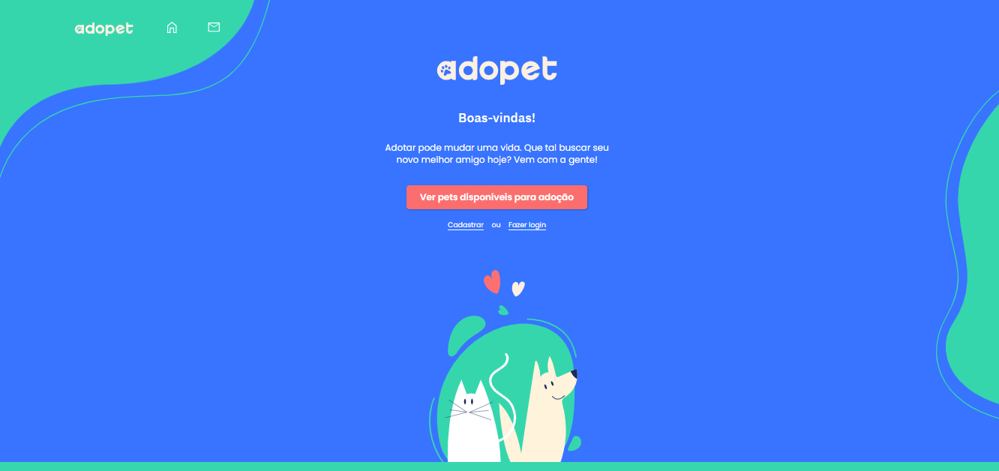

<h1 align="center"> Desafio Cypress   Site AdoPet 🐶💙🐱 </h1>

Foi desenvolvido testes automatizados do site AdoPet, usando o framework Cypress.   

  <a href="#-tecnologias">Tecnologias & Configurações</a>&nbsp;&nbsp;&nbsp;&nbsp;&nbsp;&nbsp;

 

  

## 🚀 Tecnologias & Configurações

Foi utilizado as seguintes tecnologias para criação dos testes automatizados:

- Node.js (18.16.0)
- Cypress (13.11.0)
- Biblioteca Faker.js
- Pacote cypress-mochawesome-reporter

## 💻 Como executar o projeto

Comandos utilizados desde o início do projeto, até instalações de dependências:  

📍 npm init -y  Este comando inicializa um novo projeto Node.js no diretório atual. O parâmetro -y indica para aceitar todas as configurações padrão, criando um arquivo package.json sem a necessidade de interação do usuário.   
📍npm install cypress --save-dev  
 Este comando instala a ferramenta de teste de front-end Cypress como uma dependência de desenvolvimento para o seu projeto.
   
📍npx cypress open 
Após instalar o Cypress, este comando abre a interface do Cypress Test Runner, onde você pode escrever, executar e depurar testes de front-end de forma interativa
   

📍npm install @faker-js/faker --save-dev  
Este comando instala a biblioteca Faker.js como uma dependência de desenvolvimento. Ela é usada para gerar dados falsos aleatórios, úteis para testes e desenvolvimento de software.
   
📍 npm i --save-dev cypress-mochawesome-reporter 
Este comando instala o pacote cypress-mochawesome-reporter como uma dependência de desenvolvimento para o seu projeto Node.js. Esse pacote é um plugin que permite gerar relatórios de teste no formato Mochawesome ao usar o framework de teste Cypress. Esses relatórios fornecem uma visualização mais detalhada e legível dos resultados dos testes executados com o Cypress.
   

 📍 Comandos para rodar os testes:  
 🔹 Terminal: npx cypress run  
 🔹 Interface Cypress: npx cypress open
  

 

---
Projeto desenvolvido por **Thais Mabelli** 👩💻